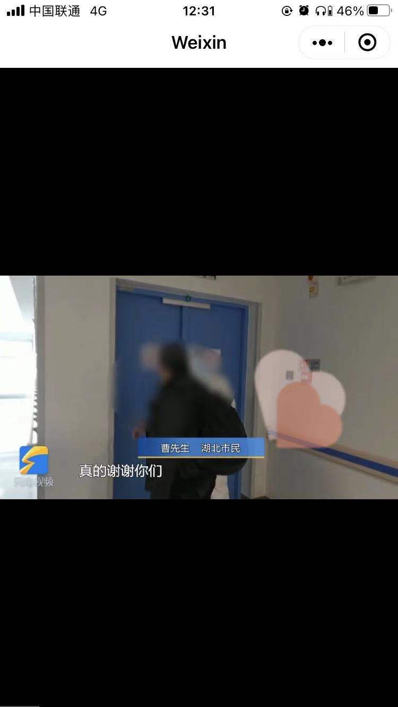

### 小程序 类 抖音快手小视频组件

解决了微信小程序官方提供的 videoswiper 的几个缺陷

1. 不能从第一个视频开始播放
2. 在视频长度为 3n+1 的情况下播放不到最后一个视频
3. 在视频长度为 3n+2 的情况下最后一条视频会重复播放倒数第二条

基本功能：双击点赞 单击暂停 进度条
拓展功能： 下拉刷新逻辑

tips： 1.[video 组件显示 Failed to load media 是怎么回事？](https://developers.weixin.qq.com/community/develop/doc/0004ecb5cf0dd0ecc0994172557000)

